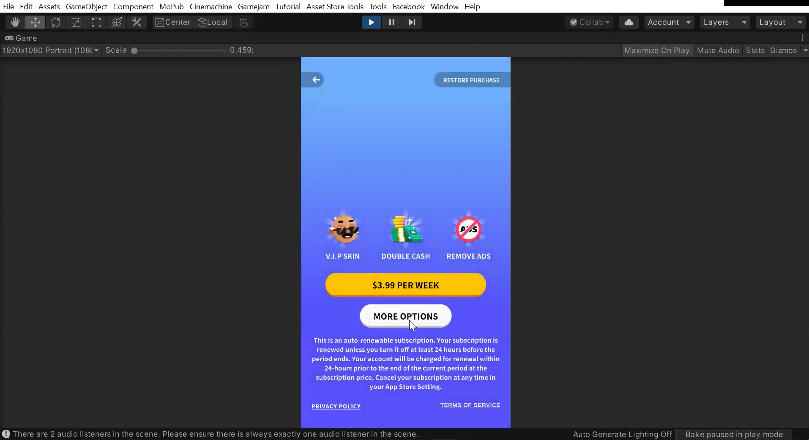
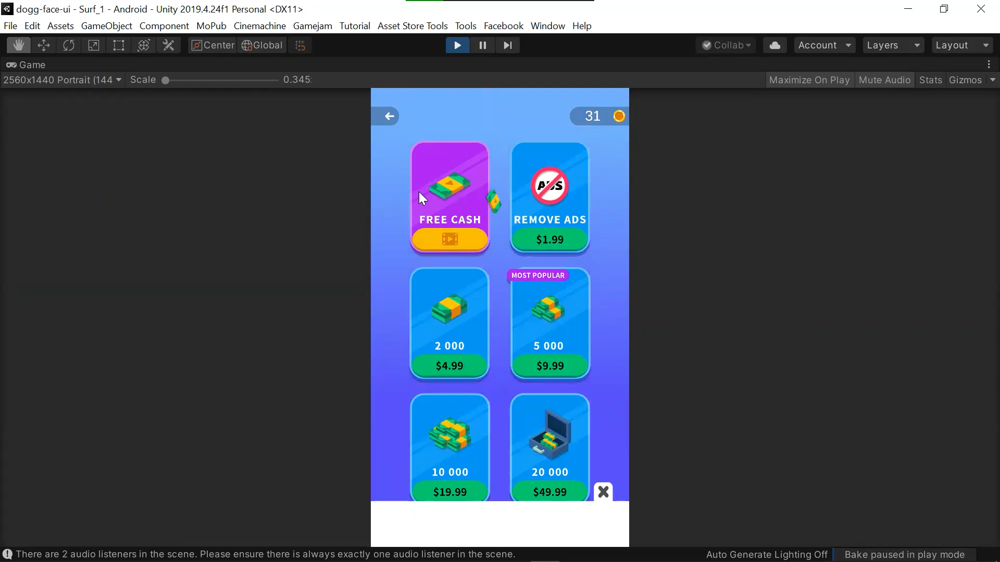
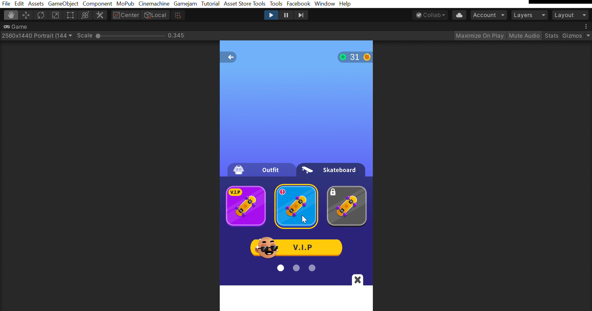
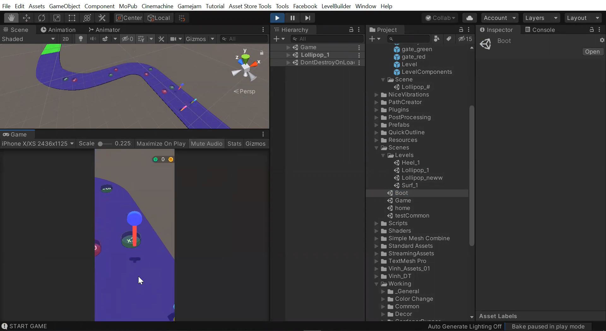
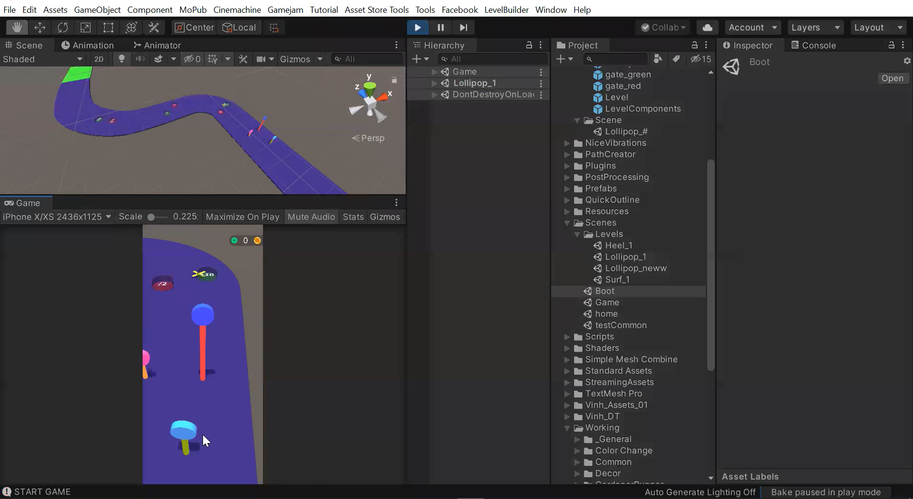
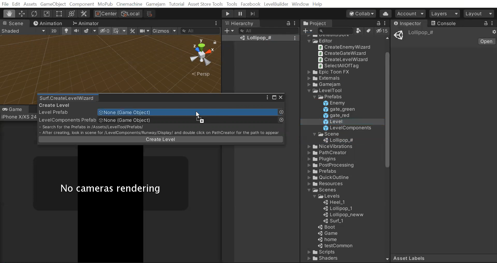
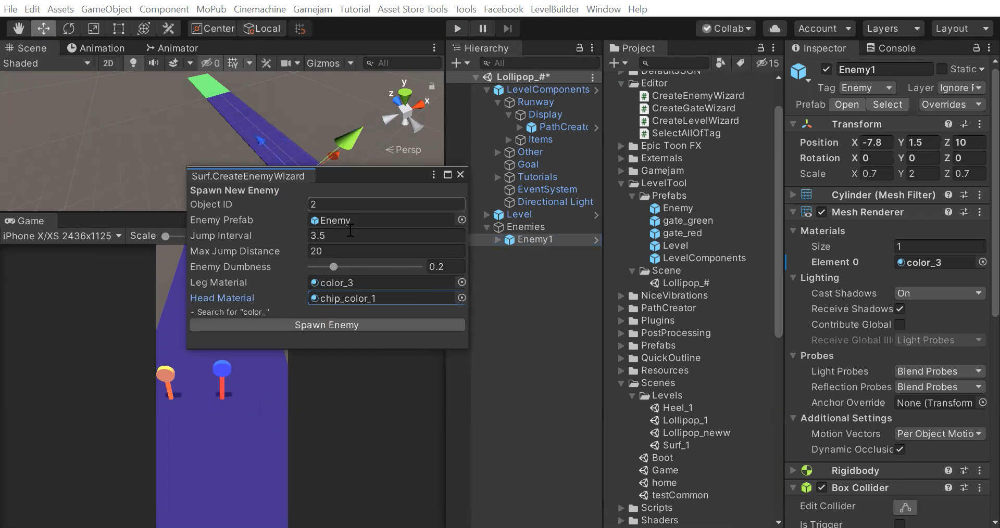

## Overview
While working at Gamejam I managed to learn a lot about working in a large team for a software project as well as learning numerous skills for C# developing in Unity.
My work there can be described in the following points:

### UI/UX
I was added to a Figma project with all of the screen layouts for an existing game project and was asked to implement the UI/UX layouts from Figma into Unity.
I created the following 3 screens accesible from the starting screen from the game, with working buttons, select options, scroll, small animations...

### Developing a game prototype

Developed an idea/brief into a game prototype, creating all of the followingg:
- Player mechanics
- Enemies AI
- Obstacles and interactions with them
- Editor Tool for Level Building

For these projects I worked with a large team providing ideas for others and implementing received feedback into my own projects.

## Further improvment
With me returning to classes and the internship ending there where many improvements left to be done for the game prototype project, including:
+ Improving the enemy AI, making them in harder difficulties seek more often green gates and avoid red gates. At the moment the AI was left only seeking to reach the GOAL and depending on the difficulty avoiding to fall of the track and jumping faster or slower.
+ Adding more obstacles to make the game more interesting.
+ Creating better 3D models for the lollipops as well as creating art for the background, goal and obstacles (Make the game better looking).
