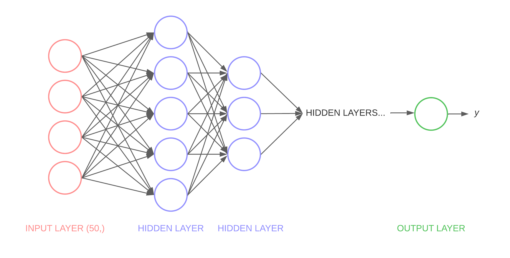
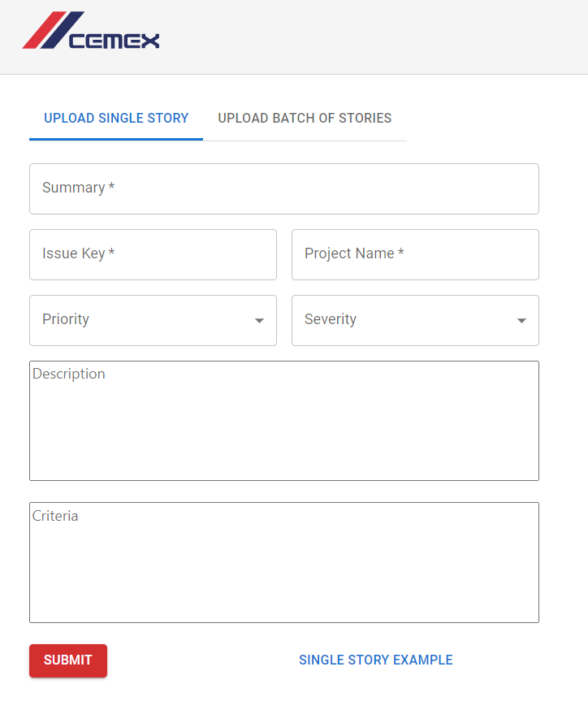
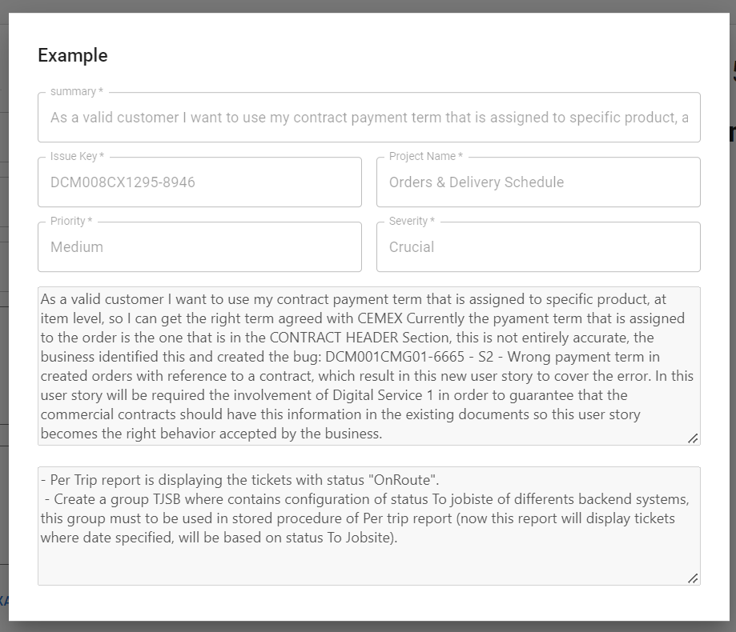
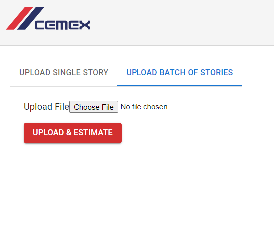
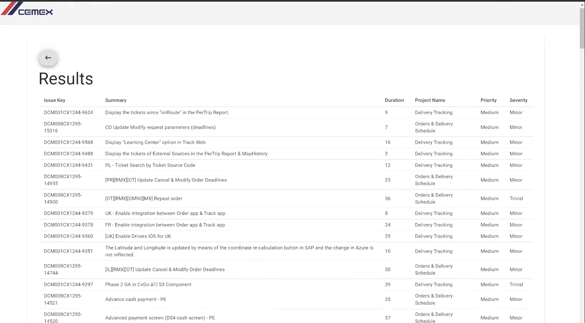
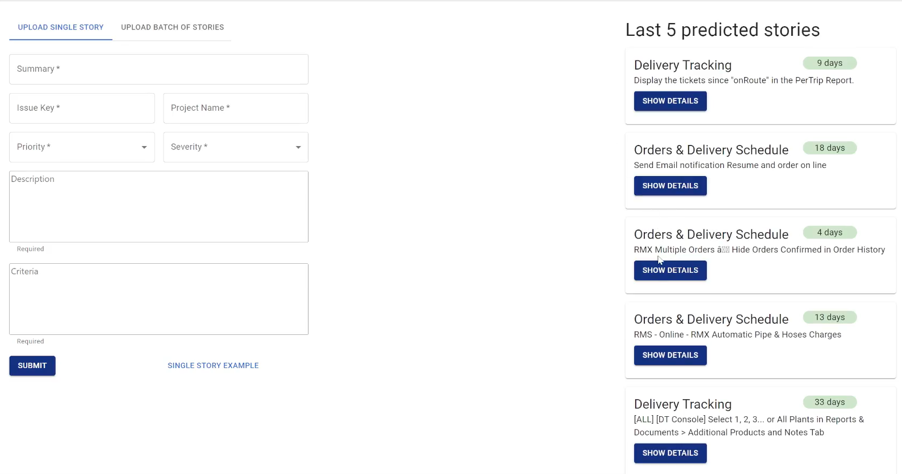

## Overview
Based in JIRA stories and tasks used for CEMEX Go, I was tasked to develop a Neural Network model to predict the effort for a given story or task (predict how much time would it take CEMEX employees to solve said task). For this I had to do Natural Language Processing and Machine Learning.

## Tools
For the creation of this project, the tools that were mainly used were:
+ Python: tensorflow.python.keras for the development of the Multilayer Perceptron Neural Network
+ React.js: for the development of the client
+ Microsoft SQL Server: for the database
+ NestJS: server for main API
+ FastAPI: server for state managment
+ Django: Server for the Neural Network estimations/predictions

## Final Product:
The Final Product is a React.js client with an interface to upload single task or a bulk of tasks (.xslx file). When a task is uploaded, the client makes a request with a Nest.js API for our tokenizer and trained Neural Network models, managed by a FastAPI server, in order to get a time prediction. The Keras Neural Network is a Multilayer Perceptron (MLP) which first does Natural Language Processing (NLP) tokenizing the input text, and then runs the values through the model weights, predicting an output. This output is then returned by the API request and the user gets on his screen the resulting prediction of effort/time needed for every inputted task. 

 

# Natural Language Processing - Tokenizer
For NLP I had to tokenize the text from every input. For this I used Pandas for reading .xslx files, Tensorflow Keras for the Tokenizer() function, and nltk for a list of stopwords.

With pandas I read specific columns from the .xslx files, being the Priority, Severity, Summary and Description of each JIRA task. All of these columns are strings.

With the Keras Tokenizer I transform each of the texts into a sequence of integers, using fit_on_texts() and texts_to_sequences() functions.

Additionally, for the Summary and Description columns I apply a formula to remove every stopword from the text, increasing the quality of the Machine Learning training.

Lastly, I join all the tokens and, as I use a MLP which needs an input of an exact shape (size), I run the Keras pad_sequences function with post padding and post truncating of 0s to set every array of input tokens to the same size (=35).

The whole list of input tokens and outputs obtained from the .xslx file are then returned to the Neural Network.

 

# Neural Network - Machine Learning
For the Neural Network I used tensorflow.python.keras to create a MLP model with regression.
|  |
|:--:|
| <b>Input layer has 35 neurons, depending on model other layers have up to 45 neurons each, this is only a simple representation of the model</b>|

### The Model
+ The model has one initial Masking layer with a mask value of 0 so that it can ignore any 0s that could have been generated in the pad_sequences function at the tokenizer. This initial layer takes an input shape of (35,).
+ The following N layers of the model are multiple Dense layers with relu activation (rectified linear unit). The amount of these layers and neurons in each is modified throughout the training of different saved models.
+ In some models we use Dropout layers with values ranging from 0.1 to 0.5 to prevent overfitting.
+ The last one is a Dense layer with a single neuron and linear activation, which is used for regression in the model.
+ The model uses the Adam optimizer from tensorflow keras, and uses the loss function of Mean Squared Error (MSE) as we seek to minimize the difference between our predictions and the actual results.

### Training
+ For the training we first split the input (X) and output (Y) tokens into training and testing data, which is randomly splited as 70% training and 30% testing data.
+ We then create a new model and run model.fit with the training values, for a varying amount of epochs and a batch size of 32. We use the test values for validation.
+ Then we evaluate the model and we get the MSE, the Root MSE and the Mean Absolute Error (MSA), this with the train data and then with the test data to see the accuracy of the trained model and determine if we would work with it or not.

These steps are ran multiple times by a main python training function, saving only the models with the lowest errors in a serialized manner. On completition, the saved models are stored, and the variables of the Neural Network are modified by the user such as number of layers, number of neurons, amount of epochs, train-test data split %, and amount of inputs (in the tokenizer and MLP model). Then the main python training function is ran again with the new configuration to seek diferent results.

If you have any additional questions of how the tokenizer or model works feel free to [contact me.](https://lcanoi.netlify.app/#contact)

 

# Client - React.js
The web app was created using React.js 
### Functions and Characteristics
This web app has two tabs with the following functions:
+ Upload Single Stories / Tasks to get a prediction.

+ Upload a Batch of Stories / Tasks in .xslx format to get a prediction for each of them.

After the stories are submitted and the estimation is requested (click on "SUBMIT" or "UPLOAD & ESTIMATE" respectively), the app displays a table with the results of each story and its prediction. 

Here we display the results of a Batch prediction with a .xslx file upload:

The website additionaly displays on a sidebar historic data of the 5 last predictions made, which can be consulted in further detail uppon clicking "SHOW DETAILS".

 

# Database, API & Server - SQL, Nest.js, FastAPI
## Project Architecture - How everything works together

### APIs
We have the Nest server connected to the client and the FastAPI server connected to the Machine Learning services.
Once we submit a story for prediction in the main client, the data is sent to the Nest server, which makes the request to the FastAPI to use its tokenizer and neural networks and return a time prediction. The Nest server receives this information, stores the data with predicted output in the SQL database, and returns everything to the client so it can be displayed. 
### Use of the SQL Database
As seen, in the client we have a sidebar displaying the recent stories with their time predictions. These and all previous estimations with data + predicted output are stored in the SQL database, and with the NestJS server we can access these components to display them on the client as historic data and to enable easy consoulting of recent work. 

