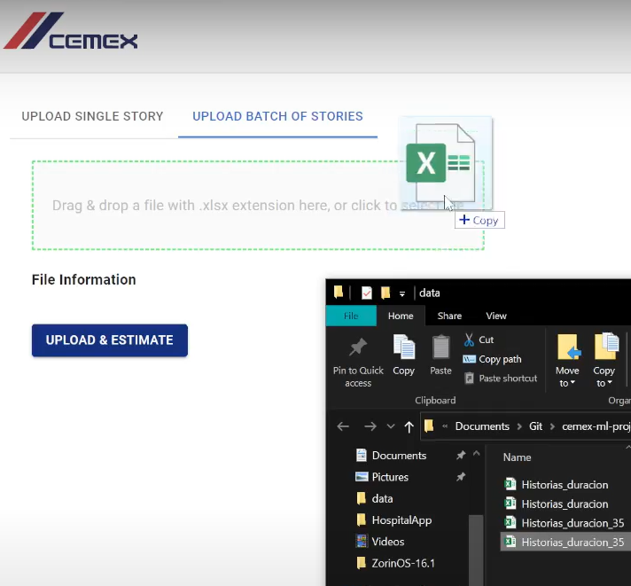
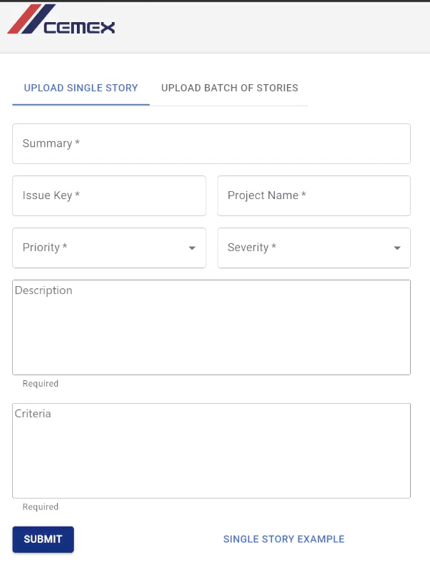
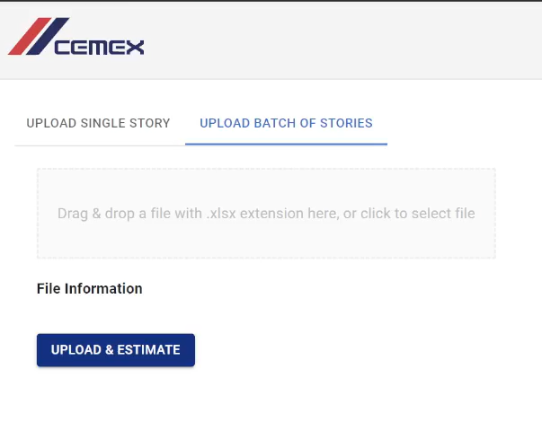

## Overview
Based in JIRA stories and tasks used for CEMEX Go, I was tasked to develop a Neural Network model to predict the effort for a given story or task (predict how much time would it take CEMEX employees to solve said task). For this I had to do Natural Language Processing and Machine Learning.

## Tools
For the creation of this project, the tools that were mainly used were:
+ Python: tensorflow.python.keras for the development of the Multilayer Perceptron Neural Network
+ React.js: for the development of the web app
+ Microsoft SQL Server: for the database
+ Nest: for the API
+ Redux: for state managment
+ Django: Server for the Neural Network estimations/predictions

## Final Product:
The Final Product is a React.js website with an interface to upload single task or a bulk of tasks (.csv file). When a task is uploaded, the website makes a request with a Nest.js API for our trained Neural Network models hosted in a Django Server. The Keras Neural Network is a Multilayer Perceptron (MLP) which does Natural Language Processing (NLP) tokenizing the input text, and then runs the values through the model, predicting an output. This output is then returned by the API request and the user gets on his screen the resulting prediction of effort for every inputted task. 

 

# Natural Language Processing - Tokenizer
For NLP I had to tokenize the text from every input. For this I used Pandas for reading .csv files, Tensorflow Keras for the Tokenizer() function, and nltk for a list of stopwords.

With pandas I read specific columns from the .csv files, being the Priority, Severity, Summary and Description of each JIRA task. All of these columns are strings.

With the Keras Tokenizer I transform each of the texts into a sequence of integers, using fit_on_texts() and texts_to_sequences() functions.

Additionally, for the Summary and Description columns I apply a formula to remove every stopword from the text, increasing the quality of the Machine Learning training.

Lastly, I join all the tokens and as I use a MLP which needs an input of an exact shape (size), I run the Keras pad_sequences function with post padding and post truncating of 0s to set every array of input tokens to the same size (=50).

The whole list of input tokens and outputs obtained from the .csv file are then returned to the Neural Network.

 

# Neural Network - Machine Learning
For the Neural Network I used tensorflow.python.keras to create a MLP model with regression.
|  |
|:--:|
| <b>Input layer has 50 neurons, other leyers have up to 60 neurons each, this is only a simple representation of the model</b>|

### The Model
+ The model has one initial Masking layer with a mask value of 0 so that it can ignore any 0s that could have been generated in the pad_sequences function at the tokenizer. This initial layer takes an input shape of (50,).
+ The following N layers of the model are multiple Dense layers with relu activation (rectified linear unit). The amount of these layers and neurons in each is modified throughout the training of different saved models.
+ The last one is Dense layer with a single neuron and linear activation, which is used for regression in the model.
+ I did not use Dropout layers as they are not needed for this solution.
+ The model uses the Adam optimizer from tensorflow keras, and uses the loss function of Mean Squared Error (MSE) as we seek to minimize the difference between our predictions and the actual results.
### Training
+ For the training we first split the input (X) and output (Y) tokens into training and testing data, which is randomly splited as 70% training and 30% testing data.
+ We then create a new model and run model.fit with the training values, for a varying amount of epochs and a batch size of 32. We use the test values for validation.
+ Then we evaluate the model and we get the MSE, the Root MSE and the Mean Absolute Error (MSA), this with the train data and then with the test data to see the accuracy of the trained model and determine if we would work with it or not.

These steps are ran multiple times by a main python training function, saving only the models with the lowest errors in a serialized manner. On completition, the saved models are stored and the variables of the Neural Network are modified, such as number of layers, number of neurons, amount of epochs, train-test data split %, and amount of inputs (in the tokenizer and MLP model). Then the main python training function is then ran again with this new configuration.
  

If you have any additional questions of how the model works or want to see the actual model, feel free to [contact me!](https://lcanoi.netlify.app/#contact)

 

# Web App - React.js
The web app was created using React.js 
### Functions and Characteristics
This web app has two tabs with the following functions:
+ Upload Single Stories / Tasks to get a prediction.

+ Upload a Batch of Stories / Tasks in .csv format to get a prediction for each of them.

After the stories are submitted and the estimation is requested, the app displays a table with the results of each story and its prediction

The website additionaly displays on a sidebar historic data of the 5 last predictions made.

 

# Database, API & Server - Microsoft SQL Server, Nest.js, Django
writting...

