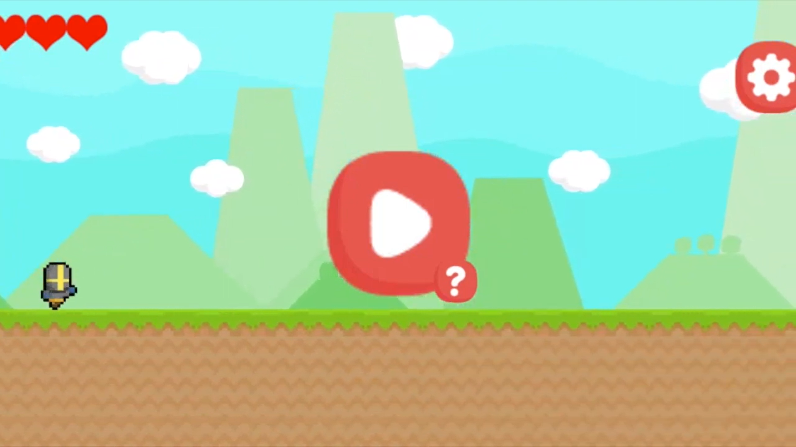
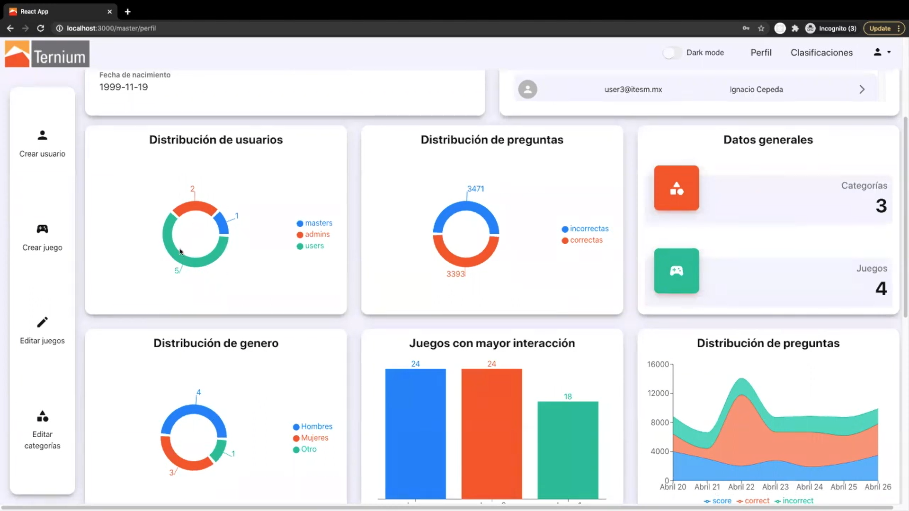

## Overview
I was tasked to create a digital platform that allows Ternium employees to train in various areas of the industry through gamification (thus developing a video game being essential). Moreover, this platform had to be connected to a website where users could access the game to learn a specific topic, and where admins could administrate the users and the games and get useful information from data created by the game.

For this project I worked in a team of 5 Computer Science students.

## Tools
For the creation of this project, the tools that were mainly used were:
+ Unity: for the development of the Ternium game where employees can train and learn about the company
+ React.js: for the development of the web app
+ MySQL: for the database containing data for the web app and for the unity game
+ Python: for the API connecting the React web app to the SQL database

## Final Product:
Here you can see a video made by the team with the final simulation of the created web and game solutions, working together with the database and API. This video is in Spanish. Everything is explained further ahead in the post.

# Game - Unity
We created a game using Unity / C#. The game is a combination of an Endless Runner and a Trivia, where the objective is to achieve the highest score possible, and there would be a leaderboard on the Web App to keep track of the best ones in each of the Trivia topics. 

### Gameplay
+ The player is found in an endless runner with 3 hearts and enemies you need to dodge: If you hit an enemy you lose a heart and at 0 hearts it is Game Over.
+ The educational part of the game is that every X amount of seconds you would get a random trivia question. The game pulls these questions from the database, using a game_id to select one related to the topic you are currently learning as a new employee at Ternium. If you get the correct answer you can recover one heart, but if you get it wrong you lose one.
+ The runner keeps getting faster and the enemies harder to dodge, and if you cannot keep up with the enemies and trivia questions you eventually come to a Game Over and if you did great a New High Score. 

With this game we ultimately looked for a balance between player skill and Trivia knowledge, keeping the game fun and relevant to the objective Ternium is trying to achieve.

# Web App - React
We created a web app using React.js. We also used Bootstrap for some of the web components. 

### Functions and Characteristics
+ This web app works with different user roles (admin, master admin, employee), and has different layouts and functions correspondingly (website changes depending on who logs in).
+ Every user has a dashboard, with graphs and data that corresponds to them or to their role.
+ An admin can create a user group of employees to manage them and receive data of their performance with the training game app.
+ An admin can create a new trivia topic for the game, and create a list of questions for it. At any moment an admin can delete or add new ones.
+ There is a leaderboard where users can see the top scorers of the TerniumRUN game.

# Database & API - MySQL & Python
We created a database which contained information about the users and the games. To have the react.js web app connected to everything else we used Redux, which worked with the Python API to connect to the database, doing actions such as storing data in the database and retriving data from it to update the dashboards and other modules in the web app.

### Uses of the Database and API
+ User creation and authentication. In the web app, a master admin could create a new admin user or employee user with email and password. This information is then saved in the database with an encrypted password, and an authentication token is created there. Then the new user can log in with his new credentials and access his own account in the web app. The user could later change his password which would call a function telling the database to make the change.
+ Game creation. In the web app, an admin could create a game with a set list of questions. This game is then saved in the database with a set game_id, and all of its questions are also saved in their own table keeping that id as a secondary key.
+ Playing a game with specific set of random trivia questions. When selecting a game from the web app, the user would be redirected to the TerniumRUN game with a set game_id. Then the unity game can pull random questions from the database with said game_id (also keeping track of the question_id to not get repeated ones).

