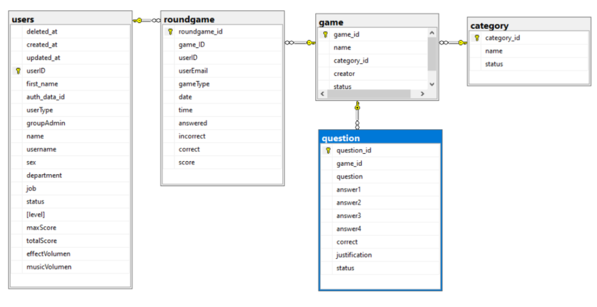

## Overview
I was tasked to create a digital platform that allows Ternium employees to train in various areas of the industry through gamification (thus developing a video game being essential). Moreover, this plataform had to be connected to a website where users could access the game to learn an specific topic, and where admins could administrate everything and get usefull information from data created by the game.
For this project I worked in a team of 5 Computer Science students.

## Tools
For the creation of this project, the tools that were mainly used were:
+ Unity: for the development of the Ternium game where employees can train and learn about the company
+ React.js: for the development of the web app
+ MySQL: for the database containing data for the web app and for the unity game
+ Python: for the API connecting the React web app to the SQL database

## Final Product:
Here you can see a video created by the team with the final simulation of the created web and game solutions, working together with the database and API. This video is in Spanish. Everything is explained further ahead in the post.

# Game - Unity
We created a game using Unity / C#. The game is a combination of an Endless Runner and a Trivia, where the objective is to achieve the highest score possible, and there would be a leaderboard on the Web App to keep track of the best ones in each of the Trivia topics. 

### Gameplay
+ The player is found in an endless runner with 3 hearts and enemies you need to dodge: If you hit an enemy you lose a heart and at 0 hearts it is Game Over.
+ The educational part of the game is that every X amount of seconds you would get a random trivia question. The game pulls these questions from the database, using a game_id to select one related to the topic you are currently learning as a new employee at Ternium. If you get the correct answer you can recover one heart, but if you get it wrong you lose one.
+ The runner keeps getting faster and the enemies harder to dodge, and if you cannot keep up with the enemies and trivia questions you eventually come to a Game Over and if you did great a New High Score. 

With this game we ultimately looked for a balance between player skill and Trivia knowledge, keeping the game fun and relevant to the objective Ternium is trying to achieve.

# Web App - React
We created a web app using React.js. We also used bootsrap for some of the web components. 

### Functions and Characteristics
+ This web app workes with different user roles (admin, master admin, employee), and had different layouts and functions correspondingly.
+ Every user has a dashboard, with graphs and data that corresponds to them or to their role.
+ An admin can create an user group of employees to manage them and receive data of their performance with the training game app.
+ An admin can create a new trivia topic for the game, and create a list of questions for it. At any moment an admin can delete or add new ones.
+ There is a leaderboard where users can see the top scorers of the TerniumRUN game.

## Database & API - MySQL & Python

