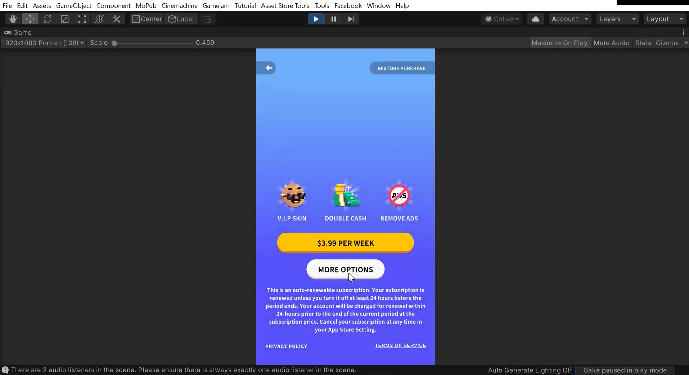
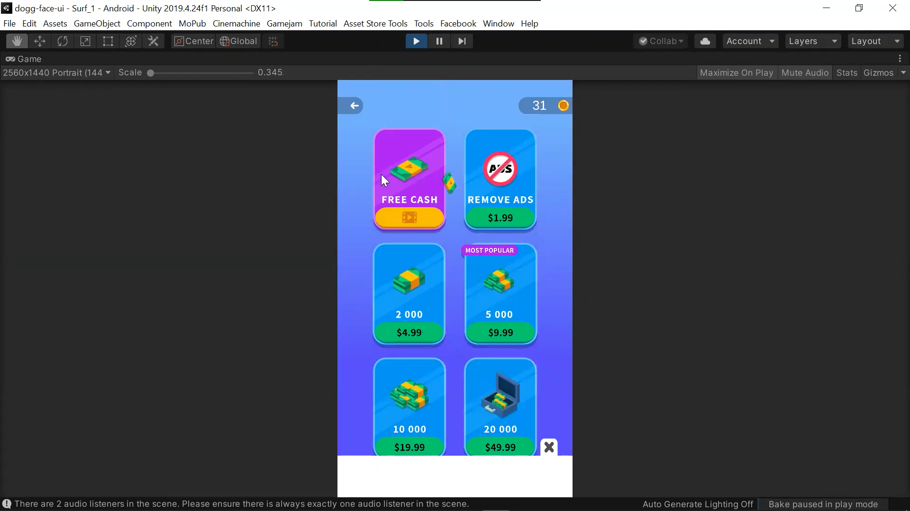
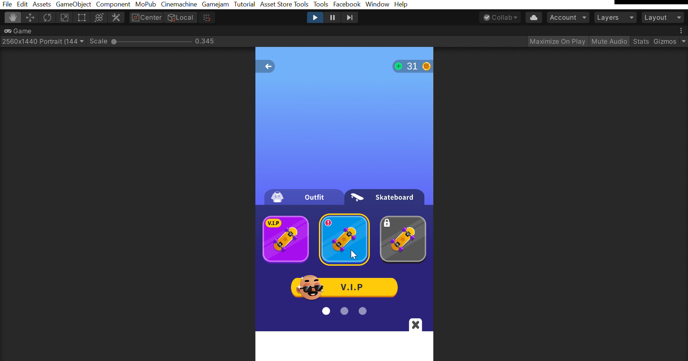
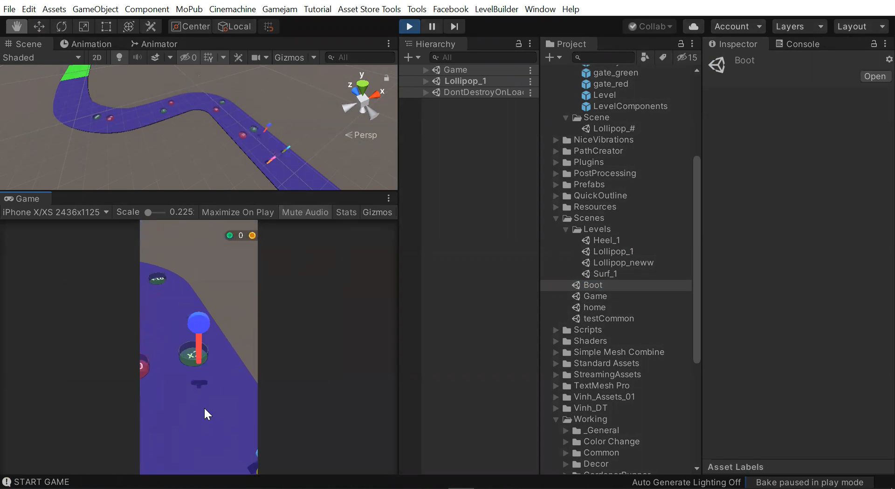
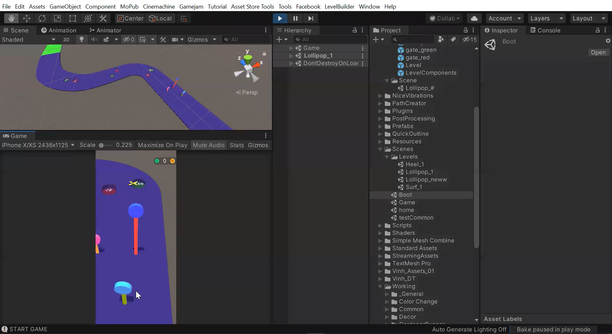
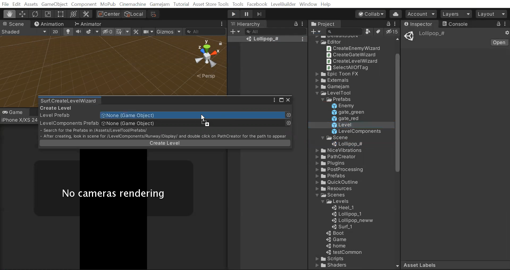
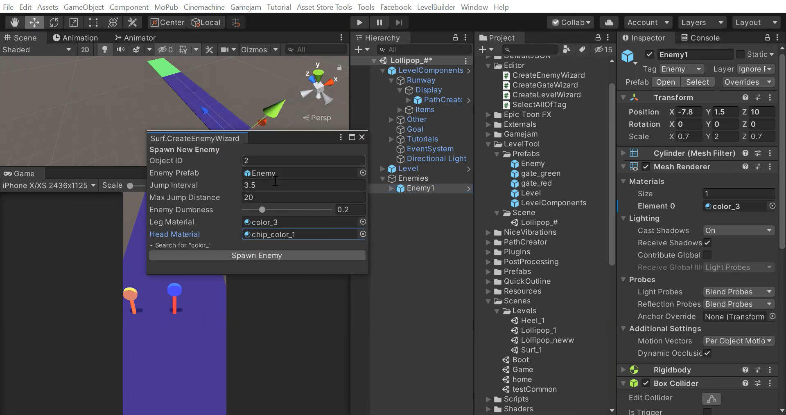

## Resumen
Trabajando con Gamejam, un desarrollador de videojuegos basado en Vietnam, llegué a aprender mucho sobre trabajar en un equipo grande para proyectos de desarrollo de software, así como aprendí muchas habilidades de C# para desarrollar en Unity.
My trabajo ahí es descrito en los siguientes puntos:

### UI/UX
Me agregaron a un proyecto de Figma con todos los diseños de pantalla para un proyecto de juego existente y se me pidió que implementara los diseños de UI / UX de Figma en Unity.
Creé las siguientes 3 pantallas accesibles desde la pantalla de inicio del juego, con botones funcionales, opciones seleccionables, scroll, pequeñas animaciones ...

### Desarrollando un prototipo de juego

Desarrollé una idea en un prototipo de un juego, realizando lo siguiente:
- Mecánicas del jugador
- IA de enemigos
- Obstáculos e interacciones con ellos
- Editor Tool para construcción de niveles

Trabajé con un equipo grande, proporcionando ideas para otros e implementado la retroalimentación recibida a mis propios proyectos. También aprendí de su flujo de trabajo que implementé en el prototipo del juego, que incluía su boot screen de Gamejam, su arquitectura de Boot - Game - Level - LevelItem, y una idea básica para el diseño de la pantalla de inicio del juego.

## Mejoras por realizar
Con mi regreso a clases y el final de la pasantía, quedaron muchas mejoras por hacer para el proyecto del prototipo del juego, que incluyen:
+ Mejorar la IA del enemigo, haciéndolos en dificultades más difíciles buscar más a menudo las puertas verdes y evitar las puertas rojas. De momento la IA se quedó solo buscando alcanzar la META y dependiendo de la dificultad evitando caerse de la pista y saltar más rápido o más lento.
+ Añadir más obstáculos para hacer el juego más interesante.
+ Crear mejores modelos 3D para las paletas, así como crear arte para el fondo, la meta y los obstáculos (hacer que el juego se vea mejor).
