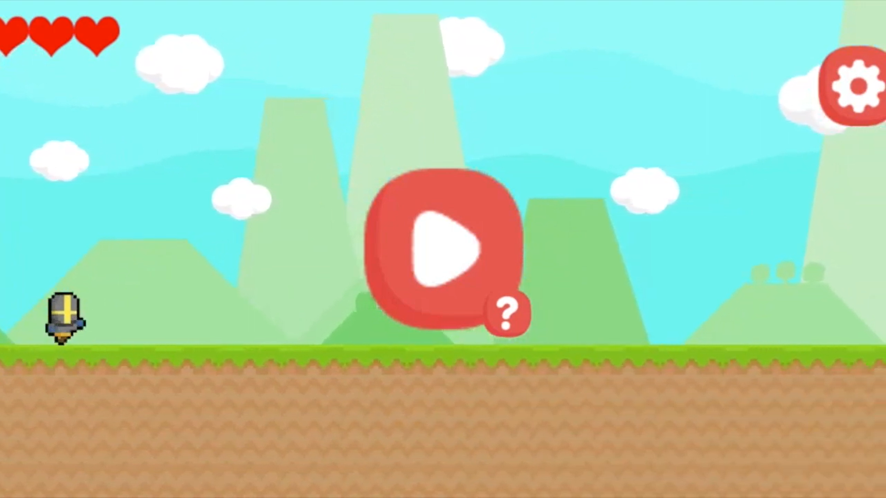
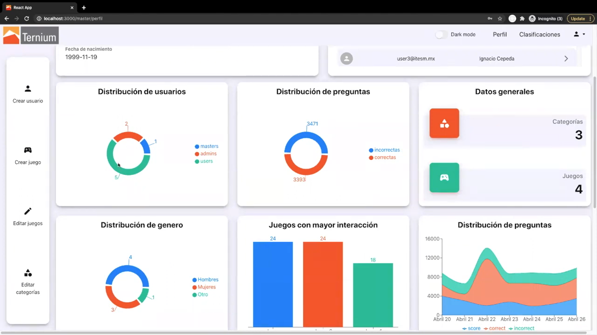

## Resumen
Me encargaron la creación de una plataforma digital que permita a los empleados de Ternium capacitarse en diversas áreas de la industria a través de la gamificación (siendo fundamental desarrollar un videojuego). Además, esta plataforma tenía que estar conectada a un sitio web donde los usuarios pudieran acceder al juego para aprender un tema específico, y donde los administradores pudieran administrar a los usuarios y los juegos y obtener información útil de los datos creados por el juego.

Para este proyecto trabajé en un equipo de 5 estudiantes de Computer Science.

## Herramientas
Para la creación de este proyecto, las herramientas que se utilizaron principalmente fueron:
+ Unity: para el desarrollo del juego de Ternium donde los empleados puedan capacitarse y conocer la empresa
+ React.js: para el desarrollo de la app web
+ MySQL: para la base de datos que contiene datos para la aplicación web y para el juego de unity
+ Python: para la API que conecta la aplicación web de React a la base de datos SQL

## Producto final:
Aquí puedes ver un video realizado por el equipo con la simulación final de las soluciones web y de juegos creadas, trabajando en conjunto con la base de datos y la API. De igual manera, todo se explica más adelante en el post.

# Juego - Unity
Creamos un juego usando Unity / C#. El juego es una combinación de Endless Runner y Trivia, donde el objetivo es lograr la mayor puntuación posible, y habría una tabla de clasificación en la aplicación web para llevar un registro de los mejores en cada uno de los temas de Trivia.

### Cómo se juega
+ El jugador se encuentra en un Endless Runner con 3 corazones y enemigos que debe esquivar: si golpeas a un enemigo pierdes un corazón y con 0 corazones se acaba el juego.
+ La parte educativa del juego es que cada X cantidad de segundos obtendrás una pregunta de trivia al azar. El juego extrae estas preguntas de la base de datos, utilizando un game_id para seleccionar una relacionada con el tema que uno está aprendiendo actualmente como nuevo empleado en Ternium. Si obtienes la respuesta correcta, puedes recuperar un corazón, pero si te equivocas, pierdes uno.
+ El corredor se vuelve cada vez más rápido y los enemigos son más difíciles de esquivar, y si no puedes seguir el ritmo de los enemigos y las preguntas de trivia, eventualmente llegas al Game Over, y si jugaste bien, podrás conseguir una nueva Puntuación Máxima.

Con este juego buscamos un equilibrio entre la habilidad del jugador y el conocimiento de Trivia, manteniendo el juego divertido y relevante para el objetivo que Ternium estaba tratando de lograr.

# App Web - React.js
Creamos una aplicación web usando React.js. También usamos Bootstrap para algunos de los componentes web.

### Funciones y Características
+ Esta aplicación web funciona con diferentes roles de usuario (administrador, administrador master, empleado) y tiene diferentes diseños y funciones de manera correspondiente (el sitio web cambia según quién inicie sesión).
+ Cada usuario tiene un tablero o dashboard, con gráficos y datos que le corresponden a él o a su rol.
+ Un administrador puede crear un grupo de usuarios de empleados para administrarlos y recibir datos de su desempeño con la aplicación del juego de entrenamiento.
+ Un administrador puede crear un nuevo tema de trivia para el juego y crear una lista de preguntas para él. En cualquier momento, un administrador puede eliminar o agregar nuevos.
+ Hay una tabla de clasificación donde los usuarios pueden ver los jugadores con máximos puntajes del juego TerniumRUN.

# Base de Datos & API - MySQL & Python
Creamos una base de datos conteniendo información sobre los usuarios y los juegos. Para tener la aplicación web react.js conectada a todo lo demás, usamos Redux, que funcionó junto a la API de Python para conectarse a la base de datos, realizando acciones como almacenar datos en la base de datos y recuperar datos de ella para actualizar los paneles y otros módulos en la aplicación web

### Usos de la Base de Datos y la API
+ Creación y autenticación de usuarios. En la aplicación web, un administrador maestro podría crear un nuevo usuario administrador o un usuario empleado con correo electrónico y contraseña. Luego, esta información se guarda en la base de datos con una contraseña encriptada y allí se crea un token de autenticación. Luego, el nuevo usuario puede iniciar sesión con sus nuevas credenciales y acceder a su propia cuenta en la aplicación web. Posteriormente, el usuario podría cambiar su contraseña, lo que llamaría a una función que le indicaría a la base de datos que realice el cambio.
+ Creación de juegos. En la aplicación web, un administrador podría crear un juego con una lista establecida de preguntas. Luego, este juego se guarda en la base de datos con un game_id establecido, y todas sus preguntas también se guardan en su propia tabla, manteniendo ese id como llave secundaria.
+ Jugar un juego con un conjunto específico de preguntas de trivia aleatorias. Al seleccionar un juego desde la aplicación web, el usuario sería redirigido al juego TerniumRUN con un game_id establecido. Entonces para la trivia, el juego de unity puede extraer preguntas aleatorias de la base de datos con dicho game_id (también haciendo un seguimiento del question_id para no repetir).
